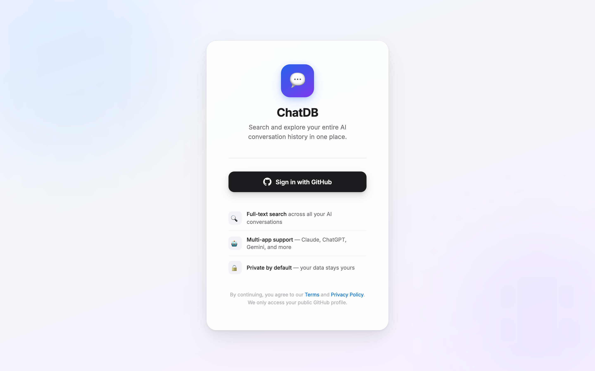
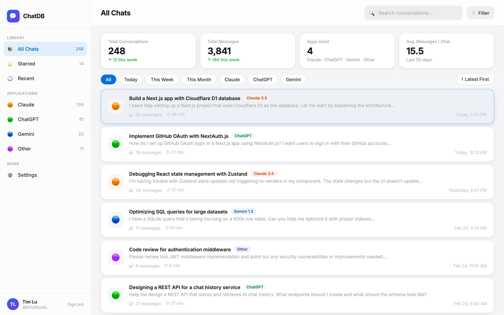
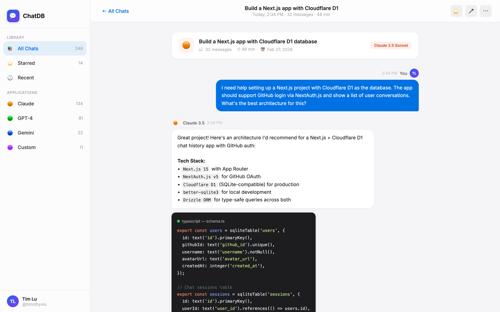
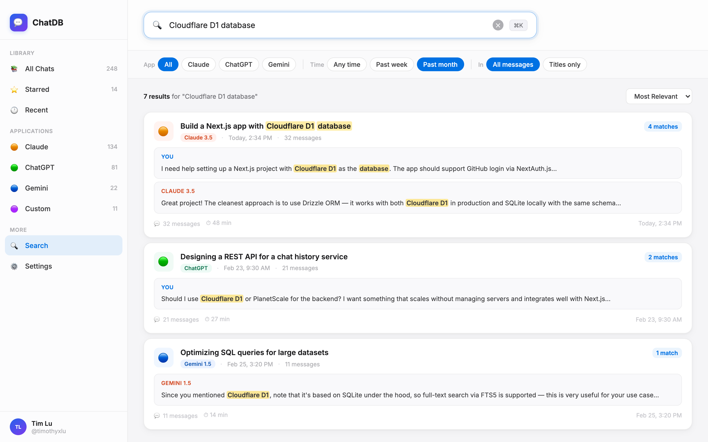
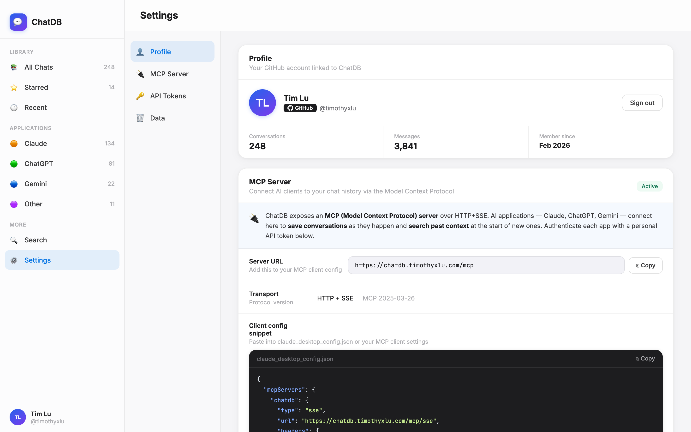

# ChatDB

**ChatDB** is a self-hosted conversation archive for AI assistants. Save conversations from Claude, ChatGPT, Gemini and any other AI app, then search across all of them — by keyword or by meaning — from a single interface.

[](LICENSE)
[](https://developers.cloudflare.com/workers/)
[](https://nextjs.org/)

---

## Screenshots

<table>
  <tr>
    <td align="center">
      <br/>
      <sub><b>Sign In</b> — GitHub OAuth, one click to get started</sub>
    </td>
    <td align="center">
      <br/>
      <sub><b>All Chats</b> — browse conversations across Claude, ChatGPT, Gemini and more</sub>
    </td>
  </tr>
  <tr>
    <td align="center">
      <br/>
      <sub><b>Chat Detail</b> — read the full conversation with syntax-highlighted code blocks</sub>
    </td>
    <td align="center">
      <br/>
      <sub><b>Search</b> — hybrid full-text + semantic search with highlighted matches</sub>
    </td>
  </tr>
  <tr>
    <td align="center" colspan="2">
      <br/>
      <sub><b>Settings</b> — MCP server URL, API tokens, and profile</sub>
    </td>
  </tr>
</table>

---

## Features

- **Conversation archive** — capture and browse sessions from any AI application
- **Hybrid search** — full-text (FTS5) and semantic (vector) search fused with Reciprocal Rank Fusion
- **MCP server** — Claude Desktop and other MCP clients can read and write your conversation history directly
- **OAuth 2.0 Dynamic Client Registration** — MCP clients connect with zero configuration via RFC 7591 DCR + PKCE
- **Browser extension** — one-click save from ChatGPT, Gemini, DeepSeek, and more AI apps
- **API tokens** — create named tokens for each client; revoke individually
- **GitHub OAuth** — single sign-in for the web UI
- **Edge-first** — runs on Cloudflare Workers; scales to zero when idle
- **Docker Compose** — full local stack in one command

---

## Architecture

```
Browser / Claude Desktop / Extension
        │
        ▼
┌───────────────────────────────────┐
│         Next.js (App Router)      │  Cloudflare Workers (edge)
│  ┌──────────┐  ┌────────────────┐ │
│  │  Web UI  │  │  MCP  /  REST  │ │
│  └──────────┘  └───────┬────────┘ │
└────────────────────────│──────────┘
                         │
           ┌─────────────┼──────────────┐
           ▼             ▼              ▼
      Cloudflare D1   Vectorize      Workers AI
      (SQLite + FTS)  (1024-dim)    (bge-m3 embed)
```

| Environment | Database | Vectors | Embeddings |
|---|---|---|---|
| Production | Cloudflare D1 | Cloudflare Vectorize | Workers AI `@cf/baai/bge-m3` |
| Local / Docker | SQLite (`@libsql/client`) | ChromaDB | Ollama `bge-m3` |

---

## Quick Start (Docker Compose)

### 1. Clone and configure

```bash
git clone https://github.com/timothyxlu/chats.git
cd chats
cp .env.local.example .env.local
```

Edit `.env.local` and fill in the three required values:

```env
AUTH_SECRET=        # openssl rand -base64 32
AUTH_GITHUB_ID=     # GitHub OAuth App client ID
AUTH_GITHUB_SECRET= # GitHub OAuth App client secret
```

> **GitHub OAuth App setup** → go to <https://github.com/settings/developers> → *New OAuth App*
> - Homepage URL: `http://localhost:3000`
> - Authorization callback URL: `http://localhost:3000/api/auth/callback/github`

### 2. Start

```bash
docker compose up
```

On first start, Ollama downloads the `bge-m3` embedding model (~570 MB). The app waits until the model is ready before accepting requests.

| Service | URL |
|---|---|
| Web UI | <http://localhost:3000> |
| ChromaDB | <http://localhost:8000> |
| Ollama | <http://localhost:11434> |

### 3. Stop / reset

```bash
docker compose down          # stop, keep data
docker compose down -v       # stop and delete all volumes (full reset)
```

---

## Local Development (without Docker)

### Prerequisites

- Node.js 20+
- An Ollama instance with `bge-m3` pulled, **or** Cloudflare AI API credentials

```bash
npm install
cp .env.local.example .env.local
# fill in .env.local
npm run db:push     # create local SQLite tables
npm run dev         # http://localhost:3000
```

### Useful scripts

| Script | Description |
|---|---|
| `npm run dev` | Next.js dev server with hot reload |
| `npm run db:push` | Push schema to local SQLite (no migration files needed) |
| `npm run db:generate` | Generate SQL migration files from schema changes |
| `npm run db:studio` | Drizzle Studio — browse the local database in a browser |
| `npm run cf:preview` | Build + run `wrangler dev` (Cloudflare Workers emulator) |
| `npm run docker:up` | `docker compose up -d` |

---

## Deployment (Cloudflare Workers)

### 1. Create Cloudflare resources

```bash
# D1 database
wrangler d1 create chatdb-prod

# Vectorize index (1024 dims, cosine — matches @cf/baai/bge-m3)
wrangler vectorize create chatdb-messages --dimensions=1024 --metric=cosine

# KV namespace (session storage)
wrangler kv namespace create chatdb-kv
```

Save the IDs printed by each command — you'll need them in step 3.

### 2. Set secrets

Add these as **encrypted secrets** in the Cloudflare Dashboard (**Workers & Pages → chatdb → Settings → Variables and Secrets**):

| Secret | Value |
|---|---|
| `AUTH_SECRET` | Random string — generate with `openssl rand -base64 32` |
| `AUTH_GITHUB_ID` | GitHub OAuth App client ID |
| `AUTH_GITHUB_SECRET` | GitHub OAuth App client secret |
| `AUTH_URL` | Your Worker URL, e.g. `https://chatdb.example.workers.dev` |

> **GitHub OAuth App setup** → <https://github.com/settings/developers> → *New OAuth App*
> - Homepage URL: `https://chatdb.example.workers.dev`
> - Authorization callback URL: `https://chatdb.example.workers.dev/api/auth/callback/github`

Or via the CLI:

```bash
wrangler secret put AUTH_SECRET
wrangler secret put AUTH_GITHUB_ID
wrangler secret put AUTH_GITHUB_SECRET
wrangler secret put AUTH_URL
```

Secrets persist across deploys — you only need to set them once.

### 3. Apply migrations and deploy (manual)

```bash
# Run the initial migration on the remote D1 database
npm run db:migrate:prod

# Build and deploy
npm run cf:deploy
```

> **Note:** For manual deploys, replace the placeholder IDs in `wrangler.toml` with the real ones from step 1 before running `cf:deploy`. Do not commit your real IDs if you plan to keep the repo public.

### 3 (alt). Auto-deploy via GitHub integration

Connect your GitHub repo in the Cloudflare Dashboard (**Workers & Pages → your worker → Settings → Builds → Connect Git**). Every push to `main` will trigger an automatic build and deploy.

Since `wrangler.toml` uses placeholder IDs (to keep the repo public), add your real IDs as **build variables** in the Cloudflare Dashboard (**Workers & Pages → chatdb → Settings → Build configuration → Edit → Build variables**):

| Variable | Value |
|---|---|
| `D1_DATABASE_ID` | ID from `wrangler d1 create` |
| `KV_NAMESPACE_ID` | ID from `wrangler kv namespace create` |

Then set the **Deploy command** to:

```bash
sed -i "s/REPLACE_WITH_YOUR_D1_ID/$D1_DATABASE_ID/" wrangler.toml && sed -i "s/REPLACE_WITH_YOUR_KV_ID/$KV_NAMESPACE_ID/" wrangler.toml && npx wrangler d1 execute chatdb-prod --remote --file db/migrations/0000_full.sql && npx wrangler deploy
```

This substitutes the placeholders at build time without exposing your IDs in the repo.

---

## MCP Integration

ChatDB exposes an MCP server at `/mcp` with full OAuth 2.0 Dynamic Client Registration (DCR). MCP clients connect automatically — no manual token needed.

### How it works

```
MCP Client (e.g. Claude Desktop)
    │
    ├─ 1. GET /.well-known/oauth-authorization-server   ← discover endpoints
    ├─ 2. POST /oauth/register                          ← register client (DCR)
    ├─ 3. GET  /oauth/authorize                         ← user approves in browser
    ├─ 4. POST /oauth/token                             ← exchange code for token
    └─ 5. POST /mcp (Bearer chatdb_tk_…)                ← MCP calls
```

### Manual tokens (browser extensions, scripts)

For clients that don't support OAuth (browser extensions, cURL, etc.), create a token manually:

1. Sign in to the web UI → **Settings** → create a new token
2. Use it as `Authorization: Bearer chatdb_tk_...`

### Available MCP tools

| Tool | Description |
|---|---|
| `create_session` | Start a new conversation session |
| `add_message` | Append a message and index it for search |
| `search_chats` | Hybrid full-text + semantic search |
| `list_sessions` | Paginated session list, filterable by app |
| `get_session` | Fetch a full session with all messages |
| `save_session` | Update session title or app |
| `get_recent_context` | Retrieve the last N messages across all sessions |

---

## REST API

All API routes require authentication — either a session cookie (web UI) or a Bearer token (`Authorization: Bearer chatdb_tk_...`).

### Ingest (browser extension → ChatDB)

```http
POST /api/ingest
Authorization: Bearer chatdb_tk_...
Content-Type: application/json

{
  "app": "chatgpt",
  "title": "Debugging a React hook",
  "source_url": "https://chatgpt.com/c/abc123",
  "messages": [
    { "role": "user",      "content": "Why does useEffect run twice?" },
    { "role": "assistant", "content": "In React 18 strict mode ..." }
  ]
}
```

Conversations with the same `source_url` are deduplicated — re-sending an existing URL is a no-op.

### Search

```http
GET /api/search?q=useEffect+strict+mode&limit=10
```

### Sessions

```http
GET /api/chats              # list sessions
GET /api/chats/:id          # session + messages
```

### Tokens

```http
GET    /api/tokens          # list tokens (metadata only, no raw values)
POST   /api/tokens          # create token — raw value returned once
DELETE /api/tokens/:id      # revoke token
```

### OAuth 2.0 (MCP client registration)

```http
GET  /.well-known/oauth-authorization-server   # server metadata (RFC 8414)
POST /oauth/register                           # dynamic client registration (RFC 7591)
GET  /oauth/authorize                          # authorization consent screen
POST /oauth/token                              # exchange code for access token
```

---

## Contributing

Contributions are welcome! Please read [CONTRIBUTING.md](CONTRIBUTING.md) before opening a pull request.

---

## License

[MIT](LICENSE)
